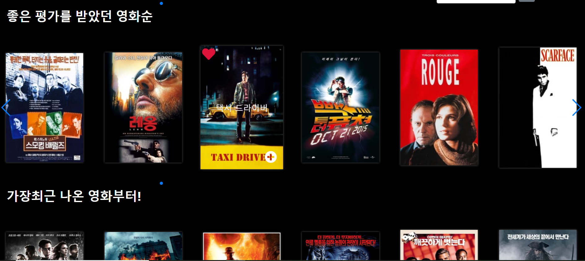

# 주정부리 final_pjt

> 배포 서버 !!
>
> https://final-pjtjj.herokuapp.com/

### 팀원 정보 및 업무 분담 내역

> 주정부리 : 주이와 노정의 정신없이 만든 프로젝트 라는 뜻입니다.

#### 팀장 : 이주이

- 영화 DB 받아오기
- 영화 MBTI 알고리즘 구현
- 영화 장르, 시대별 필터 구현
- 영화 검색엔진 구현
- 덜 지옥의 CSS
- 영화 평점 받아오기
- Community 게시판별 나누기 구현
- 리뷰목록 만들기
- 리뷰 작성 페이지 만들기

#### 팀원 : 박노정

- Accounts 앱 구현

- Community 앱 구현

- 좋아요 기능 추가

- Profile 페이지 생성

- ERD 구현

- 지옥의 CSS(Jquery)

- 프로젝트 디스플레이 개선

### 목표 서비스 구현 및 실제 구현 정보

> 개발도구 : Python , django, bootstrap, html, css, js, jquery ..

### 영화

### 

첫 페이지 animation 을 이용 

밑으로 스크롤 하게 되면 많은 사람들이 본 영화순, 좋은 평가를 받았던 영화순, 가장 최근에 나온 영화 순으로 옆으로 페이지를 넘길 수 있도록 구현 (jquery 의 swapper 를 이용하여 구현하였음. )

- 영화 장르별 찾기, 검색 엔진 이용하여 영화 찾기

장르별 영화 찾기는 form 태그와 getlist 함수를 이용하여 체크한 input 값을 들고와서 일치하는 영화를 찾아와 보여준다.

검색엔진 또한도 form 태그를 통해 검색창에 입력된 값과 DB에 있는 영화 제목과 비교하여 일치하는 영화 목록을 가지고 오도록 구현.

- 주정부리식 mbti  영화 추천

주정부리식 mbti 데이터는 기존에 인터넷에 있던 한국식 mbti 부먹찍먹.. 순위별과 한국인 mbti 순위를 조합하였고, 그 성향에 맞는 조건들을 filter 로 넣어 추천할 수 있도록 하였습니다.

- 좋아요 기능

axios 로 요청을 보내어 하트를 클릭했을때 다시 화면이 켜지지않도록 하였습니다.

- 영화 상세 페이지

영화 tmdb에서 영화 티저 유튜브 키를 받아오고 유튜브키가 있는 영화들만 따로 받아와 볼 수 있도록 만들었습니다.

 

### 커뮤니티

- 게시판 구분 

각각의 게시판을 구분해서 볼 수 있습니다.

게시판에 글을 클릭하면 상세 페이지로 넘어갈 수 있고 게시판 작성자는 글을 수정, 삭제가 가능하게 구현함.

### 관리

admin 관리자가 접속하였을 때, 따로 admin 페이지로 이동하여 데이터 정보들을 조작할 수 있도록 구현하였습니다.

### 프로필

프로필 페이지에서 좋아요 한 영화, 리뷰를 작성한 영화, 게시글, 댓글 등등을 볼 수 있도록 구현하였습니다. 기본적인 로그인 로그아웃 회원가입 정보수정 또한 구현하였습니다.

### 데이터베이스 모델링 (ERD)

### Trello

### 느낀점

- 이주이

  - 대학교 3학년 이후 프로젝트 한 적이 없어서 적응을 할 수 있을지 걱정 되었지만 좋은 페어 덕분에 잘 적응하고 나름 열심히 작업했습니다.

  - ERD를 처음부터 제대로 짜놓지않으면 중간중간 갈아엎어야하는 불상사가 생기고 똑같은 일을 반복하는 어려움이 많았었습니다. 

  - 처음부터 어떤 데이터를 받고 ERD 를 어떻게 구상할지에 대해 더 많이 생각해보는 시간이었습니다.

  -  목업을 만들어두어야하는 중요성을 깨닫게 되었습니다. 기획은 중요하다.

  - 다음에는 mbti 의 각 문항들을 형태소분석하여 더 사용자 취향에 맞는 알고리즘을 구현하도록 해야겠습니다.

    

    

- 박노정

  - 생각보다 DB를 받아오는 과정이 복잡했는데 그부분을 주이가 잘 해줘서 너무 고맙고 대견하다.
  - 기능을 구현하는데는 그리 어렵지는 않았다. 하지만 웹페이지로 그럴싸한 디자인을 만들기 위해서 애를 많이 썼는데 그 과정이 꽤 어렵기도 했고 시간이 많이 소요되었다. 그래도 이후에 적용할때는 한층 더 익숙하게 사용할 수 있을 것 같다.
  - 웹페이지를 두명의 힘으로 배포까지 하니까 보람차고 성취감이 느껴진다